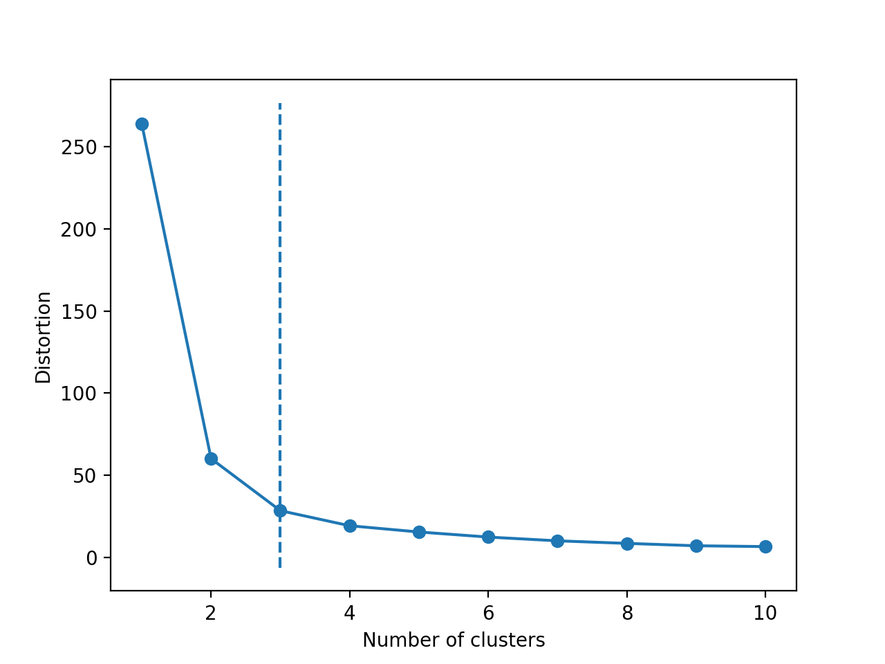
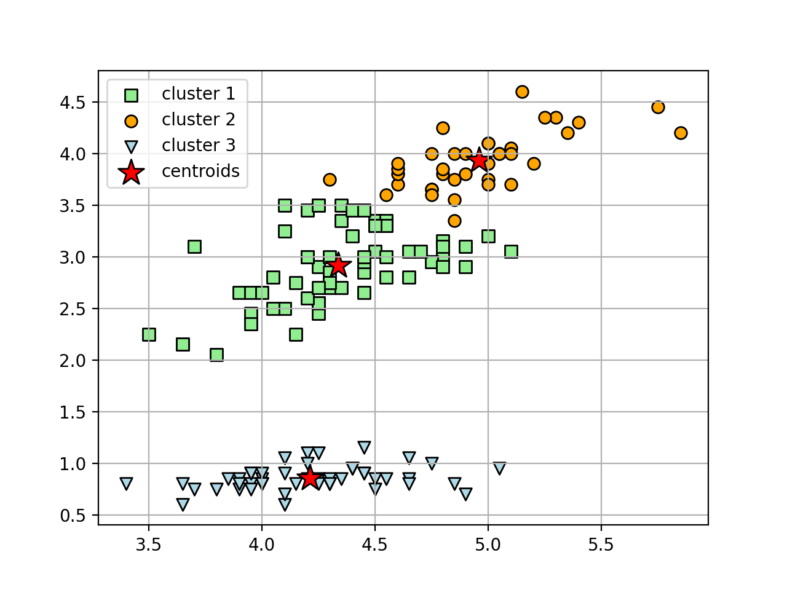

# ACM Research Coding Challenge - Rutvij

## Packages Used
* pandas - For importing csv file into a data frame and convert to a NumPy array.
* matplotlib - Creating plots.
* numpy - NumPy arrays.
* scikit-learn - Algorithm for k-Means clustering.
* kneed - Algorithm for finding the elbow/knee in a data set.

## Sources
1. Lorraine Li. 2019. K-Means Clustering with scikit-learn. (June 2019). Retrieved September 6, 2020 from https://towardsdatascience.com/k-means-clustering-with-scikit-learn-6b47a369a83c
2. ItFreakItFreak 1 and KevinKevin 5. 2018. find the "elbow point" on an optimization curve with Python. (January 2018). Retrieved September 6, 2020 from https://stackoverflow.com/questions/51762514/find-the-elbow-point-on-an-optimization-curve-with-python
3. Arvkevi. arvkevi/kneed. Retrieved September 6, 2020 from https://github.com/arvkevi/kneed

## Solution
The algorithm used for finding the number of clusters is the k-Means clustering algorithm. The k-Means algorithm implemented in the scikit-learn package is used.
Since the k-means clustering algorithm requires the number of clusters required, we first find the optimal value for k using the "elbow-method". For this, the k-means
algorithm is run on the data-set for cluster sizes from 1 to 10. The sum of squared errors for the clusters or the cluster inertia is calculated for all the cluster sizes.
The plot is obtained for Cluster Inertia vs No. of Clusters as below.

 
From the plot above, the elbow/knee point is identified using the ["Kneedle" algorithm](http://www.icsi.berkeley.edu/pubs/networking/findingakneedle10.pdf) implemented in the kneed package. The elbow represents the optimal number of clusters
in the data-set. Using this optimal number, the k-Means algorithm is run on the data set and cluster tags assigned to the points. Lastly, the points are plot as a scatter plot
and points in the same cluster are given the same shape and color.

 
 Thus we find three clusters in the data set provided using the k-Means method. Other methods might yield different numbers and
sets of of points in a cluster.
